# Dynamic Elements Manager
## Technical Project Overview

---

## 🎯 System Overview

**Dynamic Elements Manager** is a full-stack AI-powered platform that enables configuration, validation, and deployment of dynamic data processing elements. The system provides a web-based interface for creating AI analysis workflows with automated testing and calibration capabilities.

### Core Architecture
- **Frontend**: Next.js 14 with TypeScript and Tailwind CSS
- **Backend**: FastAPI with SQLAlchemy ORM
- **Database**: SQLite (development) / PostgreSQL (production)
- **AI Integration**: OpenAI GPT-4o and text-embedding-ada-002
- **Testing**: Playwright end-to-end testing framework

---

## 🏗️ System Architecture


### Technology Stack Details

**Frontend Stack:**
```typescript
// Key dependencies
{
  "next": "14.0.0",
  "react": "^18",
  "typescript": "^5",
  "@radix-ui/react-dialog": "^1.0.5",
  "tailwindcss": "^3.3.0",
  "lucide-react": "^0.291.0"
}
```

**Backend Stack:**
```python
# requirements.txt
fastapi==0.104.1
uvicorn[standard]==0.24.0
sqlalchemy==2.0.23
pydantic==2.5.0
python-multipart==0.0.6
aiofiles==23.2.1
```

---

## 🔄 User Workflows

### Configuration Workflow


### Validation Workflow


### Calibration & Testing Workflow


---

## 🛠️ API Architecture

### FastAPI Endpoints Structure


### API Request/Response Examples

**Create Element Request:**
```json
{
  "name": "Invoice Data Extractor",
  "prompt": "Extract invoice number, date, amount, and vendor from this invoice",
  "ai_model": "gpt-4",
  "method": "extraction",
  "file_type": "pdf",
  "data_sources": ["KPI tables", "Other Data"]
}
```

**Element Analysis Request:**
```python
# FastAPI endpoint implementation
@router.post("/{element_id}/analyze")
async def analyze_element(
    element_id: str,
    files: List[UploadFile] = File(...),
    additional_data: str = Form(""),
    db: Session = Depends(get_db)
):
    element = crud.element.get(db, id=element_id)
    if not element:
        raise HTTPException(status_code=404, detail="Element not found")
    
    # Process files with AI analysis engine
    result = await analysis_engine.process_element(
        element=element,
        files=files,
        additional_data=additional_data
    )
    
    return {"success": True, "analysis_result": result}
```

**AI Analysis Response:**
```json
{
  "success": true,
  "analysis_result": {
    "extracted_data": {
      "invoice_number": "INV-2024-001",
      "date": "2024-01-15",
      "amount": 1250.00,
      "vendor": "Tech Solutions Inc"
    },
    "processing_time": 2.3,
    "confidence_score": 0.92,
    "method_used": "extraction"
  }
}
```

---

## 🧠 AI Processing Architecture

### Dual Processing Methods - Detailed Architecture

#### RAG (Reasoning) Method - Vector-Based Analysis

```mermaid
flowchart TD
    DOC["📄 Document Input"] --> PREPROCESS["🔧 Text Preprocessing"]
    PREPROCESS --> CHUNK["✂️ Document Chunking<br/>(1000 char chunks)"]
    CHUNK --> EMBED_GEN["🧠 Generate Embeddings<br/>(text-embedding-ada-002)"]
    EMBED_GEN --> VECTOR_DB[("🗃️ Vector Database<br/>(In-Memory Storage)")]
    
    PROMPT["💭 User Prompt"] --> QUERY_EMBED["🧠 Query Embedding<br/>(text-embedding-ada-002)"]
    QUERY_EMBED --> SIMILARITY["📏 Cosine Similarity Search"]
    VECTOR_DB --> SIMILARITY
    SIMILARITY --> RELEVANT["📋 Top-K Relevant Chunks<br/>(Similarity > 0.7)"]
    
    RELEVANT --> CONTEXT["📝 Build Context Window"]
    CONTEXT --> GPT4_RAG["🤖 GPT-4 Analysis<br/>(with context)"]
    GPT4_RAG --> RAG_OUTPUT["✅ Contextual Analysis Result"]
    
    style DOC fill:#e1f5fe
    style VECTOR_DB fill:#f3e5f5
    style GPT4_RAG fill:#fff3e0
    style RAG_OUTPUT fill:#e8f5e8
```


#### Extraction Method - Autonomous Script Generation

```mermaid
flowchart TD
    DOC["📄 Document Input"] --> ANALYZE["🔍 Content Analysis<br/>(Structure Detection)"]
    PROMPT["💭 User Prompt"] --> GPT4_SCRIPT["🤖 GPT-4 Script Generation<br/>(Python Code)"]
    
    ANALYZE --> GPT4_SCRIPT
    GPT4_SCRIPT --> CODE_GEN["📝 Generated Python Script<br/>(JSON output format)"]
    CODE_GEN --> SYNTAX_CHECK["✅ Syntax Validation<br/>(AST parsing)"]
    
    SYNTAX_CHECK -->|Valid| SAFE_EXEC["🔒 Safe Script Execution<br/>(Restricted environment)"]
    SYNTAX_CHECK -->|Invalid| ERROR1["❌ Syntax Error"]
    ERROR1 --> REFINE1["🔄 Refine Script (Attempt 2)"]
    REFINE1 --> GPT4_SCRIPT
    
    DOC --> SAFE_EXEC
    SAFE_EXEC --> RESULT_CHECK["🧪 Result Validation<br/>(JSON format check)"]
    
    RESULT_CHECK -->|Valid JSON| SCRIPT_OUTPUT["✅ Structured Data Output"]
    RESULT_CHECK -->|Invalid| ERROR2["❌ Execution Error"]
    ERROR2 --> REFINE2["🔄 Refine Script (Attempt 3)"]
    REFINE2 --> GPT4_SCRIPT
    
    REFINE2 -->|Max Attempts| FALLBACK["⚠️ Fallback: Manual Review"]
    
    style DOC fill:#e1f5fe
    style CODE_GEN fill:#fff3e0
    style SAFE_EXEC fill:#ffebee
    style SCRIPT_OUTPUT fill:#e8f5e8
    style ERROR1 fill:#ffcdd2
    style ERROR2 fill:#ffcdd2
    style FALLBACK fill:#fff9c4
```


#### Method Comparison & Selection Logic

```mermaid
flowchart TD
    INPUT["📄 Input Document"] --> ANALYSIS["🔍 Document Analysis"]
    ANALYSIS --> STRUCT_CHECK{"📊 Structured Data?<br/>(Tables, Forms, Lists)"}
    ANALYSIS --> COMPLEX_CHECK{"🧠 Complex Reasoning?<br/>(Analysis, Insights)"}
    
    STRUCT_CHECK -->|Yes| EXTRACTION["⚙️ Extraction Method<br/>• Python script generation<br/>• Direct data parsing<br/>• Structured output"]
    COMPLEX_CHECK -->|Yes| RAG["🔍 RAG Method<br/>• Vector similarity<br/>• Contextual analysis<br/>• Reasoning-based output"]
    
    STRUCT_CHECK -->|No| COMPLEX_CHECK
    COMPLEX_CHECK -->|No| DEFAULT["🔄 User Choice<br/>(Default: Extraction)"]
    
    EXTRACTION --> EXEC_FLOW["Script Execution Flow"]
    RAG --> VECTOR_FLOW["Vector Search Flow"]
    
    style EXTRACTION fill:#e3f2fd
    style RAG fill:#f3e5f5
    style DEFAULT fill:#fff3e0
```


### RAG Implementation Example
```python
# services/analysis_engine_exact.py
async def process_with_rag(self, element: DynamicElement, content: str) -> str:
    # Chunk document
    chunks = self.chunk_document(content, chunk_size=1000)
    
    # Generate embeddings
    embeddings = []
    for chunk in chunks:
        embedding = await self.openai_client.create_embedding(chunk)
        embeddings.append(embedding)
    
    # Search for relevant content
    query_embedding = await self.openai_client.create_embedding(element.prompt)
    relevant_chunks = self.find_similar_chunks(query_embedding, embeddings, chunks)
    
    # Build context and analyze
    context = "\n\n".join(relevant_chunks)
    analysis_prompt = f"""
    User Request: {element.prompt}
    
    Relevant Context:
    {context}
    
    Please provide a detailed analysis based on the context above.
    """
    
    result = await self.openai_client.create_completion(analysis_prompt)
    return result
```

### Script Generation Implementation
```python
async def process_with_extraction(self, element: DynamicElement, content: str) -> str:
    script_prompt = f"""
    Generate a Python script to: {element.prompt}
    
    Available data:
    {content[:2000]}...
    
    Requirements:
    - Use only standard libraries (json, re, datetime, etc.)
    - Return results as JSON
    - Handle errors gracefully
    """
    
    for attempt in range(3):  # Max 3 iterations
        script_code = await self.openai_client.create_completion(script_prompt)
        
        try:
            # Execute script safely
            result = self.execute_script_safely(script_code, content)
            if self.validate_result(result):
                return result
        except Exception as e:
            script_prompt += f"\n\nPrevious attempt failed with: {str(e)}\nPlease fix the script."
    
    return "Script generation failed after 3 attempts"
```

---

## 🗄️ Database Schema

### Entity Relationship Diagram


### SQLAlchemy Models
```python
# models/dynamic_element.py
class DynamicElement(Base):
    __tablename__ = "dynamic_elements"
    
    id = Column(String, primary_key=True, default=lambda: str(uuid.uuid4()))
    name = Column(String, nullable=False)
    prompt = Column(Text, nullable=False)
    ai_model = Column(String, nullable=False)
    method = Column(String, nullable=False)  # 'reasoning' or 'extraction'
    file_type = Column(String, nullable=False)
    data_sources = Column(JSON, nullable=False)
    status = Column(String, default="draft")  # 'draft' or 'validated'
    created_at = Column(DateTime, default=datetime.utcnow)
    updated_at = Column(DateTime, default=datetime.utcnow, onupdate=datetime.utcnow)
    
    # Relationships
    dataset_entries = relationship("DatasetEntry", back_populates="element")
    uploaded_files = relationship("UploadedFile", back_populates="element")
```

### Database Operations
```python
# crud/dynamic_element.py
class CRUDDynamicElement(CRUDBase[DynamicElement, DynamicElementCreate, DynamicElementUpdate]):
    def get_by_status(self, db: Session, *, status: str) -> List[DynamicElement]:
        return db.query(DynamicElement).filter(DynamicElement.status == status).all()
    
    def validate_element(self, db: Session, *, element_id: str) -> Optional[DynamicElement]:
        db_obj = self.get(db, id=element_id)
        if db_obj:
            db_obj.status = "validated"
            db_obj.updated_at = datetime.utcnow()
            db.commit()
            db.refresh(db_obj)
        return db_obj
```

---

## 🎨 Frontend Architecture

### React Component Structure


### Context Implementation
```typescript
// contexts/dynamic-elements-context.tsx
interface DynamicElementsContextType {
  elements: DynamicElement[]
  datasetEntries: DatasetEntry[]
  loading: boolean
  error: string | null
  addElement: (element: CreateDynamicElement) => Promise<void>
  updateElement: (id: string, element: Partial<DynamicElement>) => Promise<void>
  deleteElement: (id: string) => Promise<void>
  validateElement: (id: string) => Promise<void>
  addToDataset: (elementId: string, json2: any, aiOutput: string) => Promise<void>
}

export function DynamicElementsProvider({ children }: { children: ReactNode }) {
  const [elements, setElements] = useState<DynamicElement[]>([])
  const [datasetEntries, setDatasetEntries] = useState<DatasetEntry[]>([])
  const [loading, setLoading] = useState(true)
  const [error, setError] = useState<string | null>(null)

  const addElement = async (element: CreateDynamicElement) => {
    try {
      const response = await apiClient.post('/elements/', element)
      setElements(prev => [...prev, response.data])
    } catch (error) {
      setError('Failed to create element')
      throw error
    }
  }
  
  // ... other methods
}
```

### API Client Implementation
```typescript
// lib/api.ts
class ApiClient {
  private baseURL: string

  constructor(baseURL: string) {
    this.baseURL = baseURL
  }

  async post<T>(endpoint: string, data: any): Promise<ApiResponse<T>> {
    const response = await fetch(`${this.baseURL}${endpoint}`, {
      method: 'POST',
      headers: {
        'Content-Type': 'application/json',
      },
      body: JSON.stringify(data),
    })

    if (!response.ok) {
      throw new Error(`HTTP error! status: ${response.status}`)
    }

    return response.json()
  }

  async analyzeElement(
    elementId: string,
    files: File[],
    additionalData: string
  ): Promise<AnalysisResult> {
    const formData = new FormData()
    files.forEach(file => formData.append('files', file))
    formData.append('additional_data', additionalData)

    const response = await fetch(`${this.baseURL}/elements/${elementId}/analyze`, {
      method: 'POST',
      body: formData,
    })

    return response.json()
  }
}

export const apiClient = new ApiClient(process.env.NEXT_PUBLIC_API_URL!)
```

---

## 🧪 Testing Framework

### Playwright Test Structure


### Test Implementation Example
```typescript
// tests/comprehensive-ui-tests.spec.ts
test('Complete element workflow: create, validate, add to dataset', async ({ page }) => {
  // Navigate to application
  await page.goto('http://localhost:3000')
  
  // Create element
  await page.click('button:has-text("Configure Element")')
  await page.fill('[data-testid="prompt-textarea"]', 'Extract invoice data')
  await page.selectOption('[data-testid="ai-model-select"]', 'gpt-4')
  await page.selectOption('[data-testid="method-select"]', 'extraction')
  await page.selectOption('[data-testid="file-type-select"]', 'pdf')
  await page.click('[data-testid="data-source-kpi-tables"]')
  await page.click('button:has-text("Save Configuration")')
  
  // Validate element
  await page.click('button:has-text("View Dashboard")')
  await page.click('[data-testid="test-element-1"]')
  
  // Upload test file
  const fileInput = page.locator('input[type="file"]')
  await fileInput.setInputFiles('test-files/sample-invoice.pdf')
  
  // Run analysis
  await page.click('button:has-text("Run Analysis")')
  await page.waitForText('AI Analysis Results')
  
  // Validate and add to dataset
  await page.click('button:has-text("Validate")')
  await page.click('button:has-text("Add to Dataset")')
  
  // Verify dataset entry
  await page.click('button:has-text("Open Testing Suite")')
  await expect(page.locator('[data-testid="dataset-entries"]')).toContainText('Extract invoice data')
})
```

### Test Configuration
```typescript
// playwright.config.ts
export default defineConfig({
  testDir: './tests',
  fullyParallel: true,
  forbidOnly: !!process.env.CI,
  retries: process.env.CI ? 2 : 0,
  workers: process.env.CI ? 1 : undefined,
  reporter: 'html',
  use: {
    baseURL: 'http://localhost:3000',
    trace: 'on-first-retry',
    screenshot: 'only-on-failure',
  },
  projects: [
    {
      name: 'chromium',
      use: { ...devices['Desktop Chrome'] },
    },
    {
      name: 'firefox',
      use: { ...devices['Desktop Firefox'] },
    },
  ],
})
```

---

## 🚀 Deployment & Configuration

### Environment Configuration
```bash
# Frontend .env.local
NEXT_PUBLIC_API_URL=http://localhost:8000/api/v1

# Backend .env
DATABASE_URL=sqlite:///./dynamic_elements.db
BACKEND_CORS_ORIGINS=http://localhost:3000,http://localhost:3001
UPLOAD_FOLDER=./uploads
MAX_UPLOAD_SIZE=52428800
ALLOWED_EXTENSIONS=txt,pdf,docx,csv,ppr-rx,ppr-vx
OPENAI_API_KEY=sk-...
```

### Docker Configuration
```dockerfile
# Backend Dockerfile
FROM python:3.9-slim

WORKDIR /app

COPY requirements.txt .
RUN pip install --no-cache-dir -r requirements.txt

COPY . .

EXPOSE 8000

CMD ["uvicorn", "main:app", "--host", "0.0.0.0", "--port", "8000"]
```

### Development Setup
```bash
# Start backend
cd backend
python run.py

# Start frontend (new terminal)
npm run dev

# Run tests
npm run test:comprehensive
```

---

## 📊 Performance & Monitoring

### System Metrics Dashboard


### Health Check Implementation
```python
# API health check endpoint
@app.get("/health")
async def health_check():
    try:
        # Test database connection
        db_status = await test_database_connection()
        
        # Test file system
        upload_dir_status = check_upload_directory()
        
        # Test OpenAI API (optional)
        ai_status = await test_openai_connection()
        
        return {
            "status": "healthy",
            "timestamp": datetime.utcnow().isoformat(),
            "services": {
                "database": db_status,
                "file_system": upload_dir_status,
                "ai_api": ai_status
            }
        }
    except Exception as e:
        return {
            "status": "unhealthy",
            "error": str(e),
            "timestamp": datetime.utcnow().isoformat()
        }
```

---

## 🔧 Development Workflow

### Git Workflow


### Development Scripts
```json
{
  "scripts": {
    "dev": "next dev",
    "build": "next build",
    "start": "next start",
    "lint": "next lint",
    "backend": "cd backend && python run.py",
    "test": "playwright test",
    "test:ui": "playwright test --ui",
    "test:report": "playwright show-report"
  }
}
```

---

**Dynamic Elements Manager** provides a robust foundation for AI-powered data processing with modern web technologies, comprehensive testing, and scalable architecture. The system is designed for both development flexibility and production reliability.